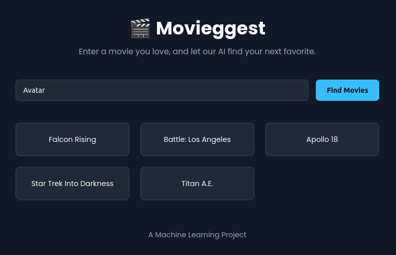

# 🎬 CineSuggest: AI Movie Recommender

A simple, content-based movie recommendation engine built with Python and Flask. CineSuggest analyzes genres, cast, and plot to suggest movies tailored to your preferences.



---

## 🚀 Getting Started

Follow these steps to set up and run CineSuggest locally.

### **Prerequisites**

- Python 3.8 or higher
- Git
- Visual Studio Code (with the "Live Server" extension)

---

### **1. Clone the Repository**

```bash
git clone https://github.com/[Your-Username]/movie-recommender.git
cd movie-recommender
```

---

### **2. Download the Dataset**

1. Visit [TMDB 5000 Movie Dataset on Kaggle](https://www.kaggle.com/datasets/tmdb/tmdb-movie-metadata).
2. Download the dataset archive.
3. Place `tmdb_5000_credits.csv` and `tmdb_5000_movies.csv` inside the `data/` folder.

> **Note:** The dataset is not included in this repository due to size constraints.

---

### **3. Start the Backend Server**

The backend runs the recommendation model and API.

```bash
cd backend
python -m venv venv
source venv/bin/activate  # On Windows: venv\Scripts\activate
pip install -r requirements.txt
python app.py
```

The backend will be running at [http://127.0.0.1:5001](http://127.0.0.1:5001). Keep this terminal open.

---

### **4. Launch the Frontend**

1. Open the project root (`movie-recommender/`) in VS Code.
2. In the file explorer, right-click `frontend/index.html`.
3. Select **"Open with Live Server"**.

Your default browser will open CineSuggest, ready for you to explore movie recommendations!

---

## 🛠️ Project Structure

```
movie-recommender/
├── backend/
│   ├── app.py
│   ├── requirements.txt
│   └── ...
├── frontend/
│   ├── index.html
│   └── ...
├── data/
│   ├── tmdb_5000_credits.csv
│   └── tmdb_5000_movies.csv
└── README.md
```

---

## 🤝 Contributing

Contributions are welcome! Please open issues or submit pull requests for improvements.

---

## 📄 License

This project is licensed under the MIT License.

---

**Enjoy discovering your next favorite movie with CineSuggest!**